# McLclSerMgr — Minecraft Local Server Manager

**Voxual** is a native Windows app that creates, runs and personalizes Minecraft servers on
your own PC. Pick the software, pick a version, accept the EULA — Voxual downloads the server
from the official source, installs a matching Java runtime if you are missing one, and gives you
a console, a config editor, player tools, backups and a full personalization layer for both the
app and the server itself.

No accounts, no telemetry, no launcher. One `Voxual.exe` (~1.9 MB, no runtime dependencies).

> Repository name: **McLclSerMgr** (Minecraft Local Server Manager). The app inside is **Voxual**.

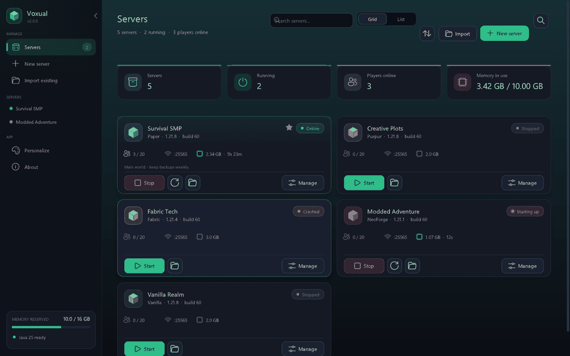

<sub>Six seconds: the server list, a live console, per-server personalization, switching the whole app to the Daylight theme, then the command palette.</sub>

---

## Contents

- [What's new in 2.0](#whats-new-in-20)
- [Features](#features)
- [Personalization: the app](#personalization-the-app)
- [Personalization: the server](#personalization-the-server)
- [Screenshots](#screenshots)
- [Install and run](#install-and-run)
- [Keyboard shortcuts](#keyboard-shortcuts)
- [Where things are stored](#where-things-are-stored)
- [Building from source](#building-from-source)
- [Developer flags](#developer-flags)
- [Repository layout](#repository-layout)
- [If something goes wrong](#if-something-goes-wrong)
- [Notes and credits](#notes-and-credits)
- [License](#license)

---

## What's new in 2.0

Version 2.0 is the **redesign + Personalization Update**:

- **New interface.** Rebuilt shell: adaptive sidebar with a running-servers list, per-page header
  bar with a clock and a search button, animated page transitions, a command palette (`Ctrl+K`),
  a cards/list server browser, and a consistent card, badge, chip and control language.
- **Six themes, twelve accents, custom colours.** Including two genuinely light themes
  (Daylight, Paper) and a high-contrast theme — every surface in the app now comes from the
  active palette, including the Win32 title bar.
- **Typography you control.** Nine interface fonts, seven code fonts, separate text and console
  sizes, all rendered from the installed Windows fonts with automatic fallbacks.
- **Layout you control.** Density (compact/comfortable/spacious), corner rounding, shadows,
  accent glow, animation speed, background style (solid, gradient, grid, dots, voxels).
- **A Personalize page in the app** with a live preview, plus a **Personalize tab per server**
  with an MOTD editor, a server-icon generator and one-click gameplay presets.
- **Theme files.** Export your look as a small JSON file and load it again later.

---

## Features

### Server management
- **Create a server in a few clicks.** Vanilla (Mojang), Paper, Purpur, Folia (PaperMC / Purpur),
  Fabric (FabricMC meta), Forge and NeoForge (their installers are run for you).
- **Java handled for you.** Detects installed Java versions, works out which one each Minecraft
  release needs, and can download a matching Temurin JRE automatically.
- **Server list with live status.** Grid of cards or a compact list, searchable and sortable,
  with players, port, memory and uptime at a glance, plus right-click actions.
- **Per-server console.** Coloured live log, text filter, level filter (all / warnings / errors),
  timestamp toggle, line wrapping, command input with history and quick command buttons.
- **Built-in config editor.** Finds `server.properties`, `bukkit.yml`, `spigot.yml`,
  `commands.yml`, `config/paper-global.yml`, plugin and mod configs (`.yml`, `.json`, `.toml`,
  `.properties`, `.cfg`, `.txt`). Syntax highlighting, line numbers, current-line highlight,
  caret-follow scrolling, indent-aware Tab/Enter, live YAML/JSON validation, `Ctrl+S`, revert,
  unsaved-changes badge and original line endings preserved.
- **Players.** Online list with avatars and Op / Kick / Ban, whitelist add, broadcast, time and
  weather commands, save-world and `list` / `tps`.
- **Plugins and mods.** Add jars, enable/disable (`.jar.disabled`), remove, open the folder, or
  browse Hangar / Modrinth.
- **Backups.** One-click world zips (a running server is saved first), restore and delete.
- **Import existing servers** without touching their files.
- **Graceful shutdown.** Closing the app stops running servers cleanly so no world data is lost.

### Assorted touches
- **Command palette** (`Ctrl+K`): jump to any page, start/stop any server, open folders, cycle themes.
- **Toasts** in any corner, with a configurable duration.
- **Optional window size memory** and a start page of your choice.

---

## Personalization: the app

Everything lives on the **Personalize** page and is saved to `settings.json` the moment you change it.

| Group | Options |
| --- | --- |
| **Theme** | Voxual Dark, Midnight, Graphite, Daylight, Paper, High contrast |
| **Accent** | 12 presets plus a custom colour picker; contrast-safe text on accents |
| **Typography** | Interface font (Segoe UI Variable, Segoe UI, Inter, Bahnschrift, Calibri, Trebuchet MS, Verdana, Tahoma, Arial), code font (Cascadia Mono/Code, Consolas, JetBrains Mono, Fira Code, Lucida Console, Courier New), text size 85–140 %, console size 85–150 % |
| **Surfaces** | Corner rounding 0–1.8×, card shadows, accent glow, animation speed (0 = off) |
| **Background** | Solid, gradient, grid, dots or voxel pattern with an intensity slider |
| **Layout** | Density (compact / comfortable / spacious), icons-only sidebar, sidebar width, status card |
| **Notifications** | Toast corner (4) and duration (1.5–12 s) |
| **Clock** | Show/hide, 12 or 24 hour |
| **Server list** | Cards or list, card size (compact / normal / large), default sort, summary tiles, on-card action buttons |
| **Console** | Lines kept in memory (500–20 000), timestamp prefix, line wrapping, follow output |
| **Editor** | 2 or 4 space indents, line wrapping |
| **Storage** | Servers folder, default memory for new servers, data folder shortcut |
| **Java** | Detected runtimes, install Java 8 / 17 / 21 / 25, rescan |
| **Safety** | Confirm destructive actions, stop servers when quitting, page to open on launch, remember window size |
| **Theme files** | Export the whole look to JSON, load it back, or reset to defaults |

<table>
<tr>
<td width="50%">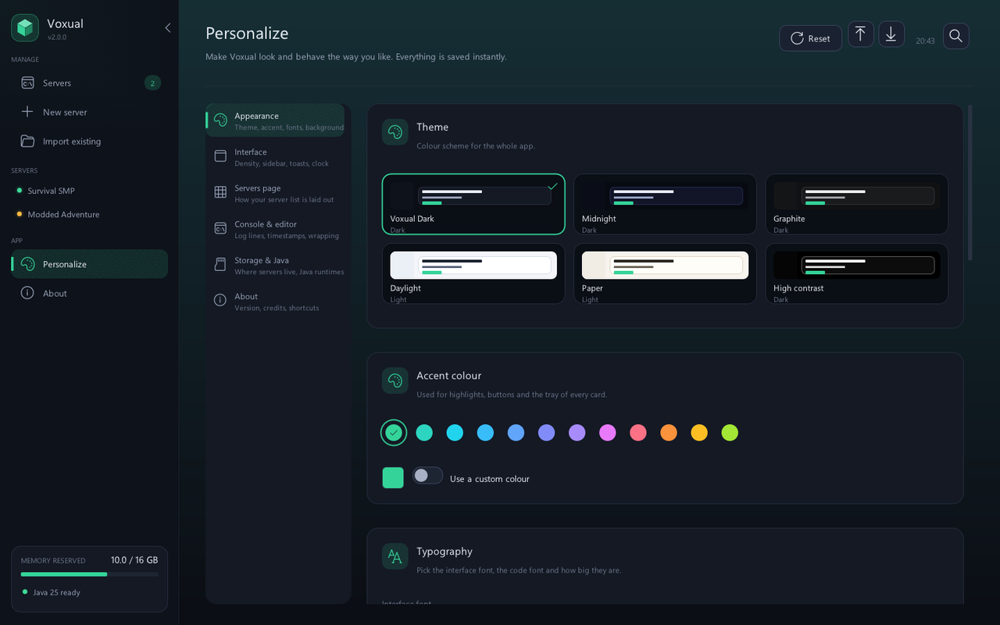<br><em>Appearance: themes, accents, fonts, surfaces</em></td>
<td width="50%">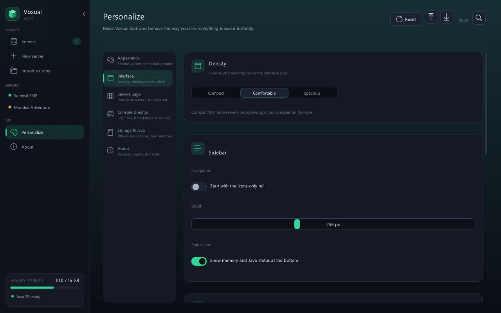<br><em>Interface: density, sidebar, toasts, clock</em></td>
</tr>
</table>

---

## Personalization: the server

Each server has a **Personalize** tab that writes to that server's own files.

| Group | Options |
| --- | --- |
| **In Voxual** | Display name, card colour (10 presets or the software colour), pin to top, free-form note |
| **Message of the day** | Live multiplayer-list preview, `&` colour codes, 16-colour palette picker, bold and reset helpers |
| **Server icon** | Seven generated 64×64 patterns (blocks, gradient, split, checker, rings, stripes, grass) with two cycleable colours — written as `server-icon.png`. Or point at your own image and Voxual crops and scales it to 64×64 |
| **One-click presets** | Vanilla feel, Just for friends, Creative sandbox, Performance first, Modded heavy, Hardcore survival (also suggest sensible memory) |
| **Gameplay** | Difficulty, game mode, hardcore, PvP, allow flight, command blocks, monsters, animals, spawn protection, max players |
| **World** | World folder, seed, world type, view distance, simulation distance, nether |
| **Access** | Online mode, whitelist, enforce whitelist, port, copy-the-address button |
| **Resource pack** | Pack URL, prompt text, required on join |

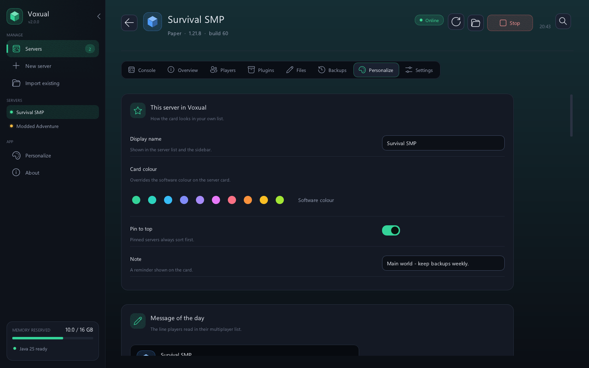

---

## Screenshots

| | |
| --- | --- |
| 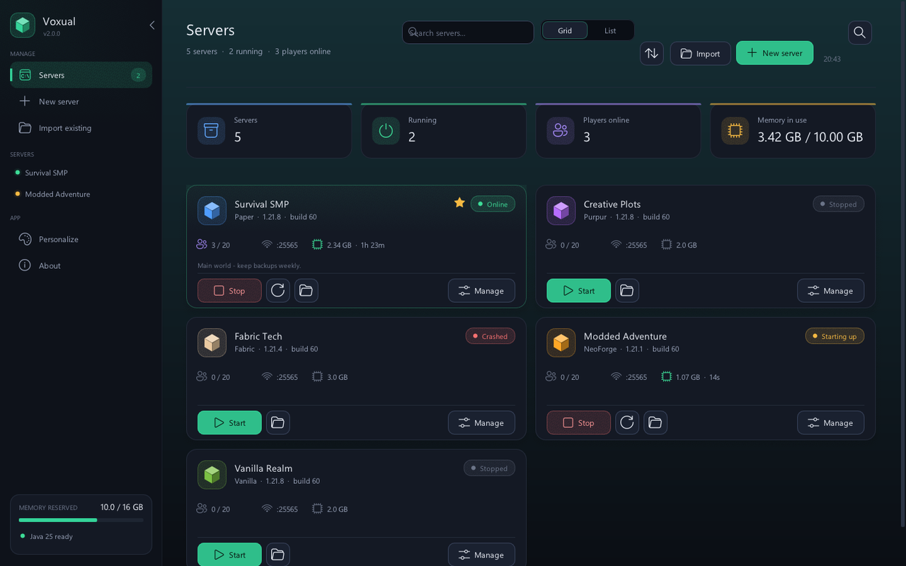 <br> *Server cards with live status* | 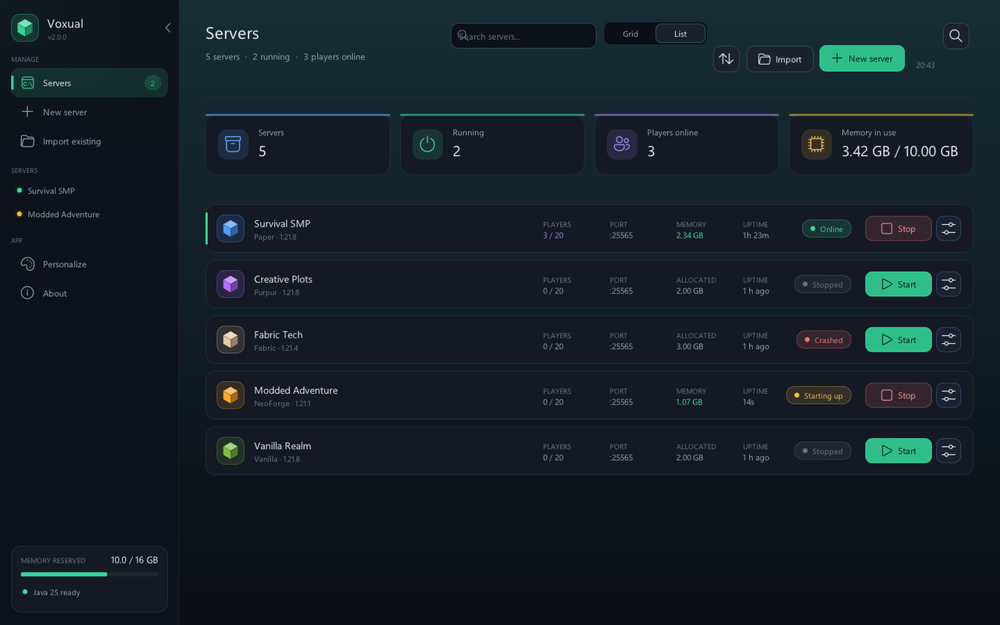 <br> *Compact list view* |
| 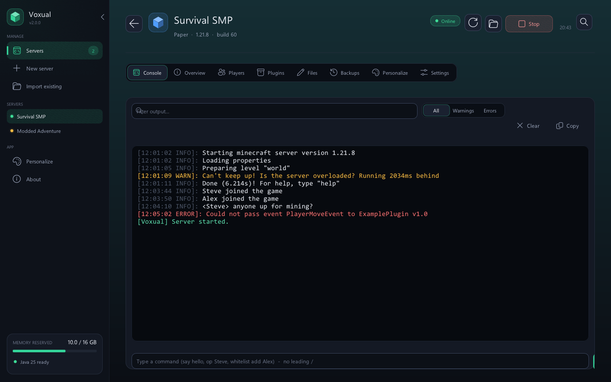 <br> *Live console with filters and quick commands* | 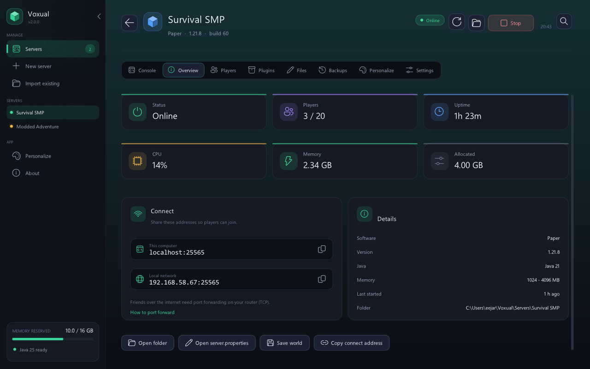 <br> *Overview with stats, connect addresses and details* |
| 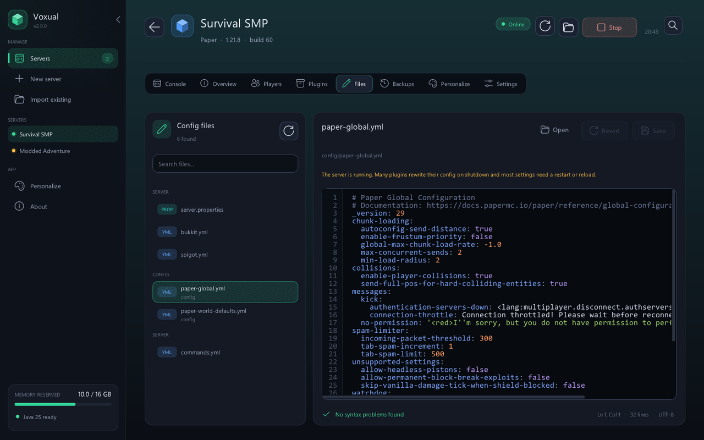 <br> *Config editor with highlighting and validation* | 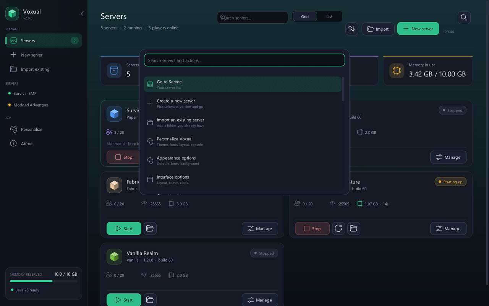 <br> *Command palette (`Ctrl+K`)* |
| 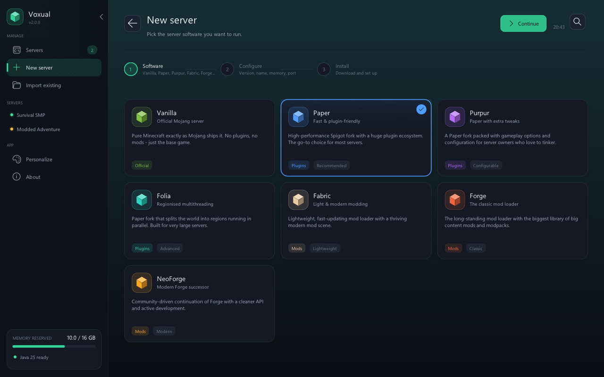 <br> *New-server wizard* | 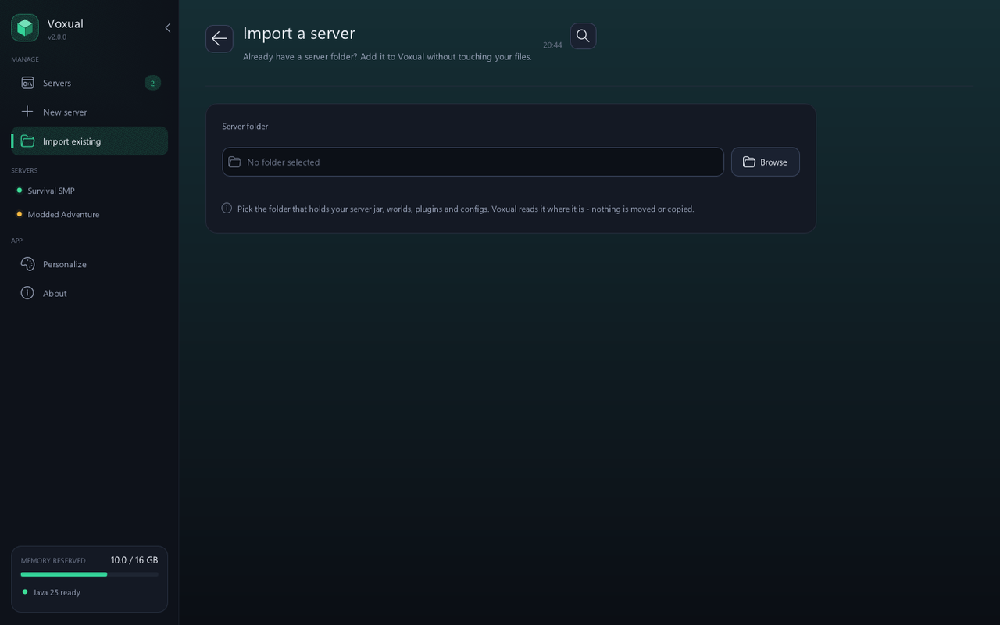 <br> *Import an existing server folder* |
| 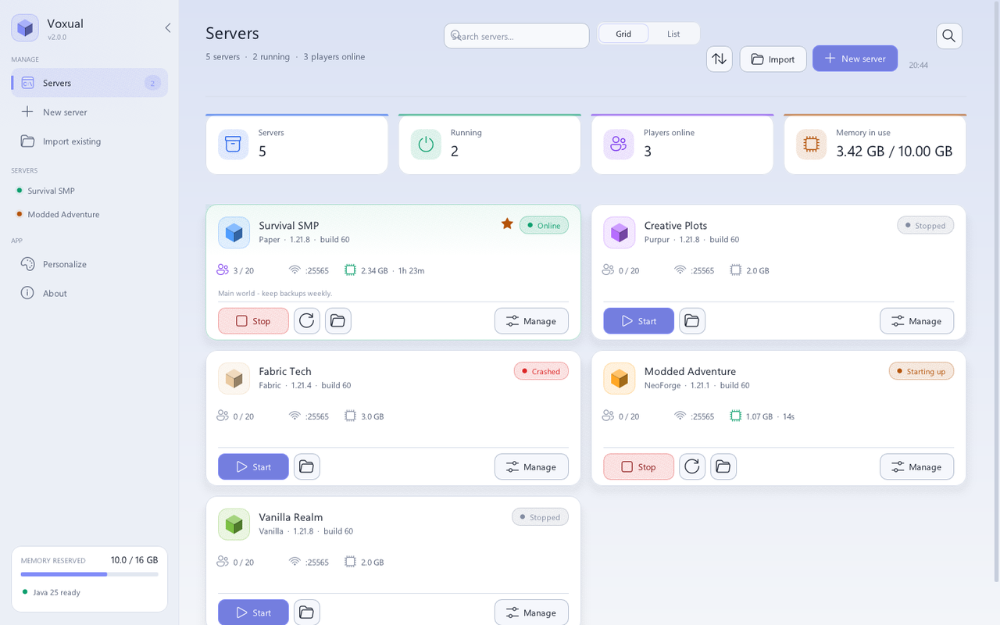 <br> *Daylight theme* | 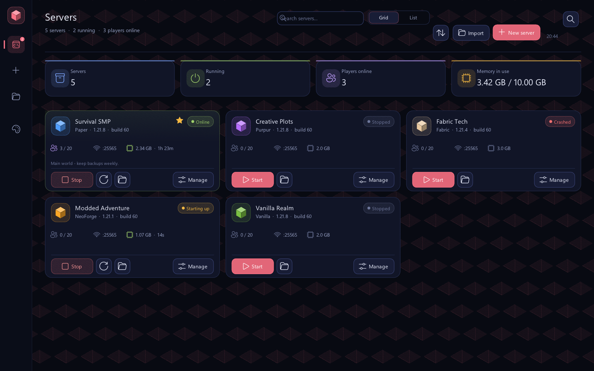 <br> *Midnight theme, icons-only rail, voxel background* |

---

## Install and run

**Portable:** double-click `dist\Voxual.exe` (no installation, no admin rights).

**Installer:** run `dist\VoxualSetup.exe`. It installs for your user account, creates Start menu
and desktop shortcuts, registers Voxual under *Apps & features* and can be uninstalled from there.
Running it again updates an existing install.

Installer options for scripting: `/S` (silent), `/D=<folder>`, `/NODESKTOP`, `/NOSTARTMENU`,
`/NOLAUNCH`; uninstall with `Uninstall.exe /uninstall [/S] [/REMOVEDATA]`.
Uninstalling never touches your servers or worlds.

---

## Keyboard shortcuts

| Keys | Action |
| --- | --- |
| `Ctrl+K` | Open the command palette |
| `Ctrl+S` | Save the file open in the config editor |
| `Up` / `Down` | Previous / next command in the console |
| `Esc` | Close the command palette |

---

## Where things are stored

| What | Where |
| --- | --- |
| New servers | `%USERPROFILE%\Voxual\Servers` (changeable in Personalize → Storage) |
| Backups | `<servers folder>\Backups\<server id>` |
| App settings, server list, theme | `%APPDATA%\Voxual` (`settings.json`, `servers.json`) |
| Downloaded Java runtimes | `%APPDATA%\Voxual\runtimes` |
| Installed app (installer) | `%LOCALAPPDATA%\Programs\Voxual` |

---

## Building from source

Requirements: Visual Studio Build Tools (MSVC), CMake and Ninja. Node.js is only needed to
regenerate the icon.

```
build.bat
```

Output: `dist\Voxual.exe` and `dist\VoxualSetup.exe` (the installer embeds the app).
If `Voxual.exe` is running and locked, the new build is saved as `dist\Voxual-new.exe`.
All dependencies (Dear ImGui, nlohmann/json) are vendored in `third_party/`.

### Logo and icon

The logo is rendered in code (`src/logo.cpp`). `res/logo.svg` is the vector version, and
`res/app.ico` (16–256 px) plus `res/logo.png` are generated with:

```
node tools/make_icon.js <path to Voxual.exe>
```

---

## Developer flags

| Flag | Purpose |
| --- | --- |
| `--demo` | Fill the list with fake servers (nothing is saved) |
| `--data <dir>` | Use a throwaway app-data folder (safe testing) |
| `--page servers\|wizard\|wizard2\|install\|detail0..7\|editor\|settings\|personalize\|about\|import\|palette\|quit` | Open a page directly |
| `--shot file.png` | Render a frame to a PNG and exit |
| `--scale 1.5`, `--size W H`, `--frames N` | Override DPI scale, window size and captured frame (with `--shot`) |
| `--script file.txt` | Feed scripted input for UI tests: `click X Y`, `press X Y`, `dragto X Y`, `release`, `move X Y`, `char TEXT`, `key NAME [ctrl+]`, `wheel DY`, `wait N`, `shot NAME` |
| `--stress-ui N` | Mutate one personalization option every other frame (themes, accents, fonts, density, rounding…) — shakes out appearance bugs |
| `--crash-test` | Deliberately fault, to verify crash reporting and the recovery prompt |
| `--dump-theme file.json` | Write the resolved theme (palette, accent, fonts, density, backdrop colour) and exit — handy for bug reports |
| `--dump-icon <dir>` | Dump raw logo renders (used by the icon build tool) |
| `--selftest paper:1.21.8 log.txt` | End-to-end check: install a real server, start it, run a command, back it up, stop it |

---

## Repository layout

```
src/
  main.cpp           Win32 + D3D11 host, screenshot / script / dump modes
  app.cpp            shell: backdrop, sidebar, page header, command palette, modals
  app_servers.cpp    server list: cards, rows, stats, sorting, context menus
  app_detail.cpp     detail tabs: console, overview, players, plugins/mods, backups, settings
  app_server_look.cpp per-server personalization: identity, MOTD, icon generator, presets
  app_settings.cpp   the Personalize page (appearance, interface, layout, console, storage, about)
  app_wizard.cpp     new-server wizard + import page
  app_files.cpp      config editor (highlighting, validation, Ctrl+S)
  theme.h/.cpp       palettes, accents, fonts, metrics, backdrop painting
  ui.h/.cpp          widgets: buttons, inputs, tabs, cards, badges, toasts, modals
  motd.h/.cpp        Minecraft MOTD colour codes + list-entry preview
  server.cpp         process control, console pipe, player tracking, backups
  installer.cpp      background install job (resolve, Java, download, loader installer)
  providers.cpp      version lists and download URLs for every server type
  java.cpp           Java discovery and Temurin download
  http.cpp           WinHTTP client
  store.cpp          settings + server list persistence
setup/setup_main.cpp installer / uninstaller
res/                 icon, logo, manifest, version resources
docs/screenshots/    images used by this README
tools/make_icon.js   builds app.ico / logo.png
```

---

## If something goes wrong

Voxual keeps a breadcrumb trail of what it was doing and writes a report if it ever hits an
unexpected error:

- **`%APPDATA%\Voxual\crash-<date>.log`** — what happened, the exception and address, the last
  steps the app took (page, theme and personalization values being applied), a stack trace and the
  loaded modules. Attach the newest one when reporting a problem.
- **Crash recovery** — if the previous run did not exit cleanly, the next start says so and offers
  a one-click **Reset appearance** (servers, folders and Java runtimes are never touched), which
  gets you out of a crash loop caused by an appearance setting.
- **`sessions.crashed`** marker plus the session marker live in the same folder if you want to see
  which run failed.

## Notes and credits

- **Data migration:** builds before 2.0 kept their data in `%APPDATA%\CraftDeck`. On first launch
  Voxual moves that folder to `%APPDATA%\Voxual` once, so your server list, settings and
  downloaded Java runtimes carry over.
- **Minecraft server files** are downloaded from Mojang, PaperMC, Purpur, FabricMC, Forge and
  NeoForge. Running a server requires accepting the
  [Minecraft EULA](https://aka.ms/MinecraftEULA).
- **Not affiliated with Mojang Studios or Microsoft.** Minecraft is a trademark of Mojang Synergies AB.
- Vendored third-party libraries: [Dear ImGui](https://github.com/ocornut/imgui) (MIT) and
  [nlohmann/json](https://github.com/nlohmann/json) (MIT). Their notices are recorded in
  [NOTICE](NOTICE).

---

## License

Copyright 2026 eefamilyai.

Licensed under the **Apache License, Version 2.0** — see [LICENSE](LICENSE) for the full text,
or <http://www.apache.org/licenses/LICENSE-2.0>.

You may use, modify and redistribute this project (including commercially) as long as you keep
the copyright and licence notices, state significant changes, and include a copy of the licence.
The licence also provides an express grant of patent rights from contributors.

Bundled third-party components keep their own licences (both MIT, compatible with Apache 2.0) and
are listed with their copyright holders in [NOTICE](NOTICE):

| Component | Licence | Copyright |
| --- | --- | --- |
| [Dear ImGui](https://github.com/ocornut/imgui) (includes stb headers by Sean Barrett) | MIT | © 2014-2026 Omar Cornut |
| [JSON for Modern C++](https://github.com/nlohmann/json) | MIT | © 2013-2023 Niels Lohmann |

Minecraft is a trademark of Mojang Synergies AB; this project is not affiliated with Mojang
Studios or Microsoft.
